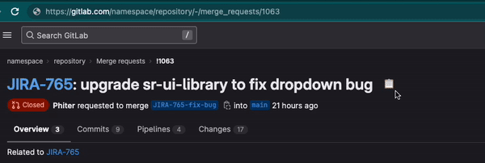

# copy-gitlab-mr-to-clipboard
Creates a formatted message for slack from the gitlab MR page.

[](gitlab-mr-to-slack.user.js?raw=1)





---

## How it works

The message is created in markdown and converted to HTML, and it can be pasted directly into your slack chat.

It uses three emojis (my company's Slack has them). You can either remove the emojis or include them in your slack directory.

The emojis are:

| Name | Image |
| - | - |
| [:partymerge:](https://slackmojis.com/emojis/6040-partymerge) |  |
| [:gitlab:](https://slackmojis.com/emojis/1402-gitlab) |  |
| [:jira:](https://slackmojis.com/emojis/38054-atlassian-jira) |  |


The final message looks like this on Slack: (if you have the emojis). If there isn't a JIRA ID, the "Open on Jira" part isn't shown:

>   [JIRA-765](<https://company.atlassian.net/browse/JIRA-765> "Issue in Jira"): fix a bug I created when I was drunk  
> [**Files changed:**](https://gitlab.com/namespace/repository/-/merge_requests/1063/diffs) 17 | [**Commits:**](https://gitlab.com/namespace/repository/-/merge_requests/1063/commits) 9 | **Project:** [namespace/repository](https://gitlab.com/namespace/repository)  
>   [**Open on GitLab**](https://gitlab.com/namespace/repository/-/merge_requests/1063) &nbsp;&nbsp;&nbsp;  [**Open on Jira**](https://company.atlassian.net/browse/JIRA-765)

Looks like this on Slack:


---
This is the full markdown that is copied in a MR that contains a JIRA ticket ID in the title. 
<details>
```
    > :partymerge:  [JIRA-765](<https://company.atlassian.net/browse/JIRA-765> "Issue in Jira"): fix a bug I created when I was drunk
    > [**Files changed:**](https://gitlab.com/namespace/repository/-/merge_requests/1063/diffs) 17 | [**Commits:**](https://gitlab.com/namespace/repository/-/merge_requests/1063/commits) 9 | **Project:** [namespace/repository](https://gitlab.com/namespace/repository)  
    > :gitlab:  [**Open on GitLab**](https://gitlab.com/namespace/repository/-/merge_requests/1063) &nbsp;&nbsp;&nbsp;:jira:  [**Open on Jira**](https://company.atlassian.net/browse/JIRA-765)
```

</details>

----

### Usage

1. Install [TamperMonkey](https://www.tampermonkey.net/) or a similar tool.
2. Open [this link for the user script](gitlab-mr-to-slack.user.js?raw=1)
3. Install the script.
4. A new icon should show up near your merge request titles.

If you don't want the emojis, just edit the user script. Feel free to modify it to suit your needs. The code is easy to understand and modify.